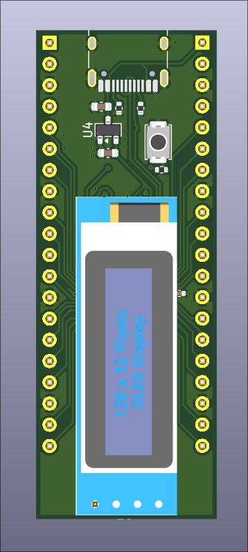
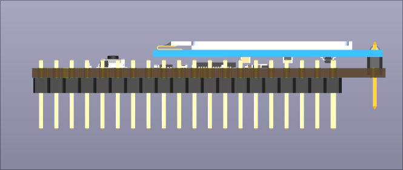
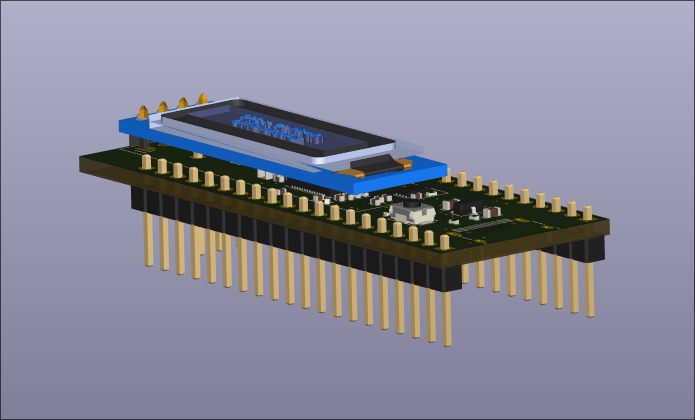

# RP2040 Devboard with OLED

## About 

This repository documents my first PCB hardware project. 

The goal was not to create a completely original product but to understand how to develop one. 

I wanted to learn how devboards are designed, study each subsystem and make small modifications. 

Through this project I learned:

- Kicad workflow 
- schematic design
- PCB layouts
- design rules (DRC/ERC) & how to resolve them
- USB connections 
- power distribution 
- decoupling 
- I²C communication
- datasheets 
- adding an OLED display 

## Inspiration

The original inspiration came from Kai Pereira's RP2040 development board and accompanying tutorial.

## What I Changed

- Added an OLED display connected over I²C
- Minor routing/layout changes
- Learned how to resolve DRC issues
- Explored footprint selection and placement

## Current Status

✔ Schematic complete

✔ PCB routed

✔ DRC passes

❌ Board not manufactured yet

